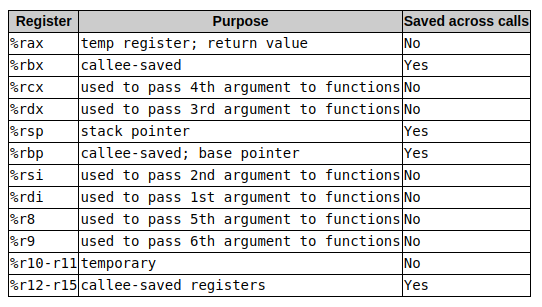
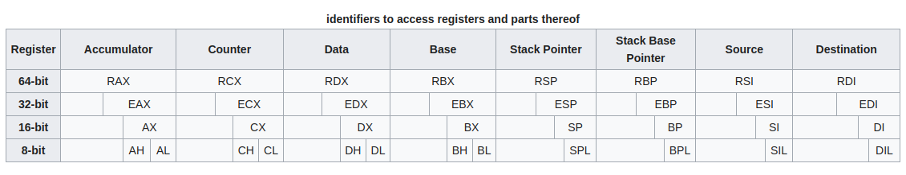
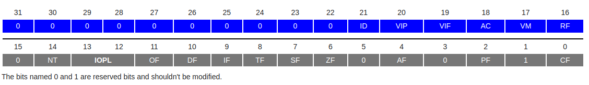

# **Reverse Engineering**

## **Notes**:

General-Purpose Registers (GPR) - 16-bit naming conventions
The 8 GPRs are as follows:

- Accumulator register (AX). Used in arithmetic operations
- Counter register (CX). Used in shift/rotate instructions and loops.
- Data register (DX). Used in arithmetic operations and I/O operations.
- Base register (BX). Used as a pointer to data (located in segment register DS, when in segmented mode).
- Stack Pointer register (SP). Pointer to the top of the stack.
- Stack Base Pointer register (BP). Used to point to the base of the stack.
- Source Index register (SI). Used as a pointer to a source in stream operations.
- Destination Index register (DI). Used as a pointer to a destination in stream operations.

In 16-bit mode, the register is identified by its two-letter abbreviation from the list above. In 32-bit mode, this two-letter abbreviation is prefixed with an 'E' (extended).

In the 64-bit version, the 'E' is replaced with an 'R' (register)

It is also possible to address the first four registers (AX, CX, DX and BX) in their size of 16-bit as two 8-bit halves. The least significant byte (LSB), or low half, is identified by replacing the 'X' with an 'L'. The most significant byte (MSB), or high half, uses an 'H' instead. For example, CL is the LSB of the counter register, whereas CH is its MSB.

 

### **EFLAGS Register**

The EFLAGS is a 32-bit register used as a collection of bits representing Boolean values to store the results of operations and the state of the processor.

0.	CF : Carry Flag. Set if the last arithmetic operation carried (addition) or borrowed (subtraction) a bit beyond the size of the register. This is then checked when the operation is followed with an add-with-carry or subtract-with-borrow to deal with values too large for just one register to contain.
2.	PF : Parity Flag. Set if the number of set bits in the least significant byte is a multiple of 2.
4.	AF : Adjust Flag. Carry of Binary Code Decimal (BCD) numbers arithmetic operations.
6.	ZF : Zero Flag. Set if the result of an operation is Zero (0).
7.	SF : Sign Flag. Set if the result of an operation is negative.
8.	TF : Trap Flag. Set if step by step debugging.
9.	IF : Interruption Flag. Set if interrupts are enabled.
10.	DF : Direction Flag. Stream direction. If set, string operations will decrement their pointer rather than incrementing it, reading memory backwards.
11.	OF : Overflow Flag. Set if signed arithmetic operations result in a value too large for the register to contain.
12-13.	IOPL : I/O Privilege Level field (2 bits). I/O Privilege Level of the current process.
14.	NT : Nested Task flag. Controls chaining of interrupts. Set if the current process is linked to the next process.
16.	RF : Resume Flag. Response to debug exceptions.
17.	VM : Virtual-8086 Mode. Set if in 8086 compatibility mode.
18.	AC : Alignment Check. Set if alignment checking of memory references is done.
19.	VIF : Virtual Interrupt Flag. Virtual image of IF.
20.	VIP : Virtual Interrupt Pending flag. Set if an interrupt is pending.
21.	ID : Identification Flag. Support for CPUID instruction if can be set.

### **Instruction Pointer**

The EIP register contains the address of the next instruction to be executed if no branching is done.

EIP can only be read through the stack after a call instruction.

## Ref:
- https://en.wikibooks.org/wiki/X86_Assembly/X86_Architecture
- https://cs.brown.edu/courses/cs033/docs/guides/x64_cheatsheet.pdf